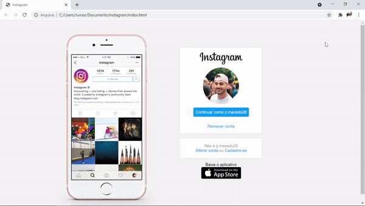

# Recreating an Instagram Landing Page

This is my first Bootcamp Project by Digital Innovation One.

The challenge was recreating an Instagram Landing Page, focusing on how to learn the concept of Flexbox and responsiveness.
***
### Project:

  

***

### :electron:	 Technologies:

***
### 📑 License:

